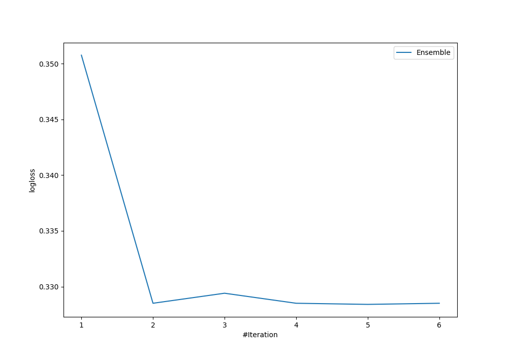
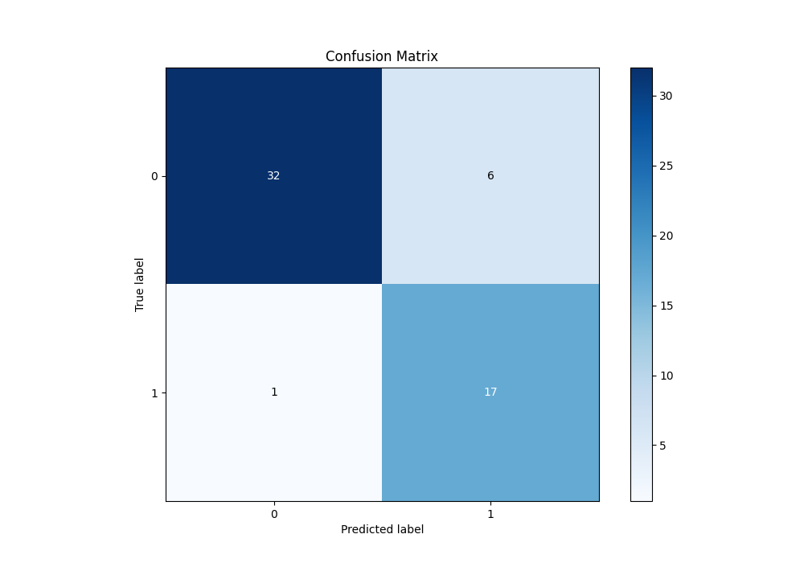
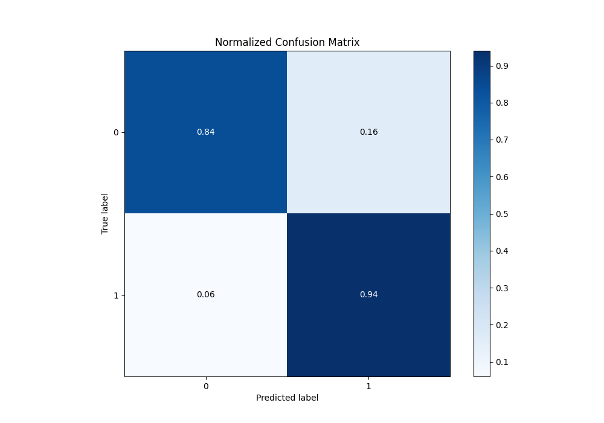
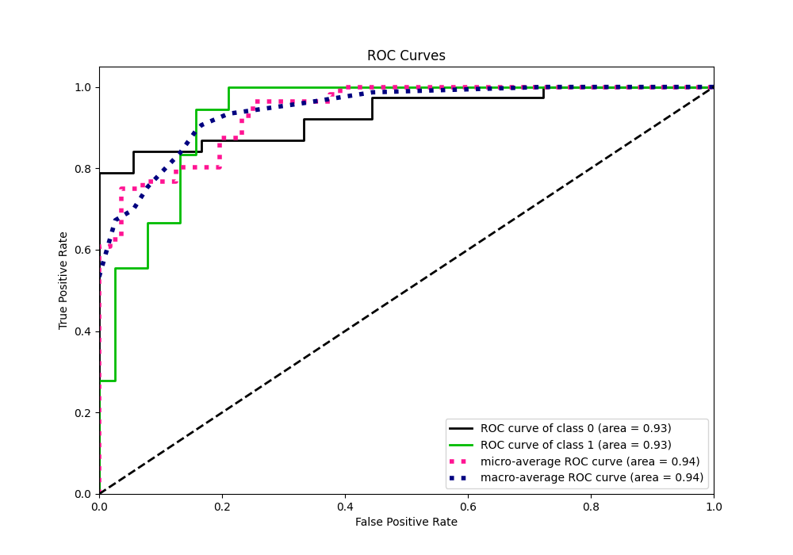
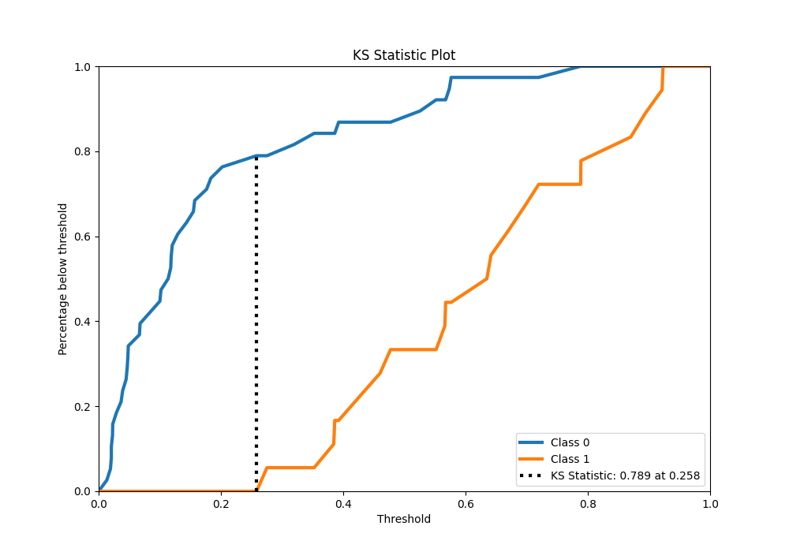
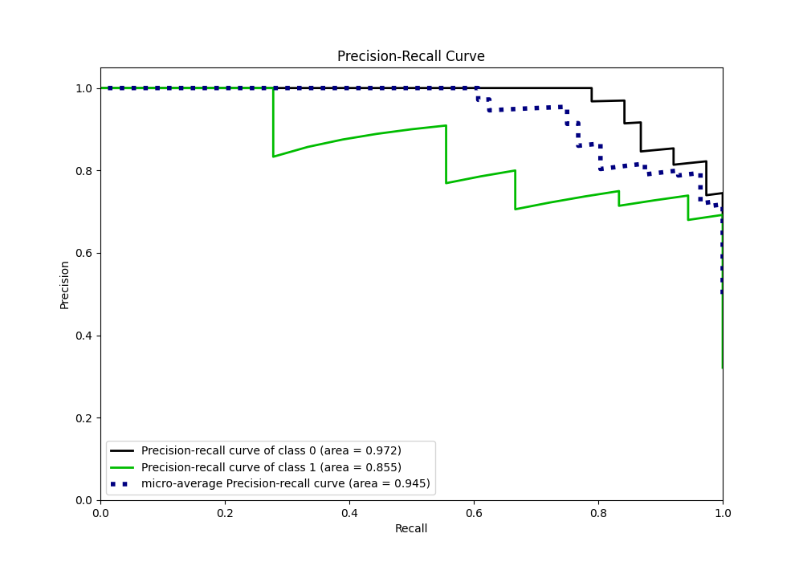
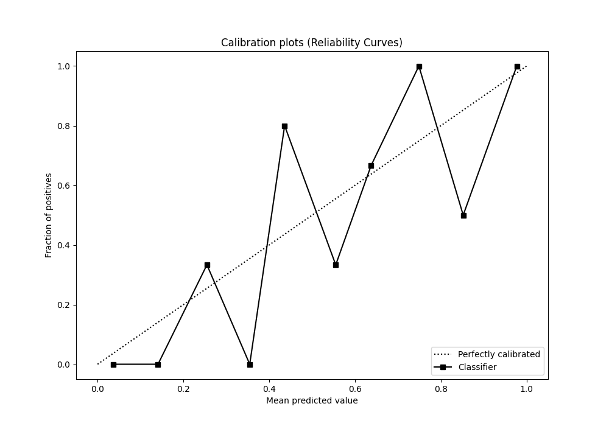
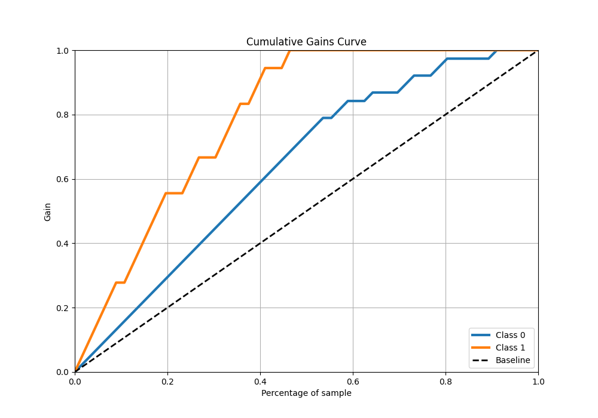
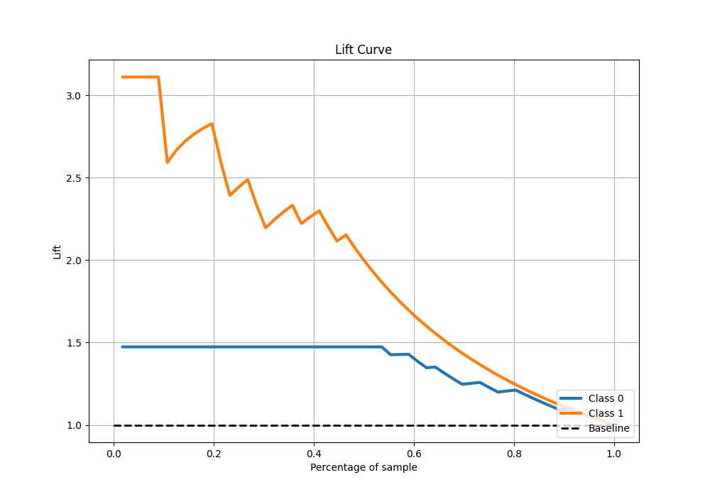

# Summary of Ensemble

[<< Go back](../README.md)

## Ensemble structure
| Model                  |   Weight |
|:-----------------------|---------:|
| 3_Linear               |        2 |
| 6_Default_RandomForest |        3 |

## Metric details
|           |    score |   threshold |
|:----------|---------:|------------:|
| logloss   | 0.328403 |  nan        |
| auc       | 0.932749 |  nan        |
| f1        | 0.829268 |    0.357868 |
| accuracy  | 0.875    |    0.357868 |
| precision | 0.909091 |    0.604225 |
| recall    | 1        |    0.012091 |
| mcc       | 0.746678 |    0.357868 |

## Metric details with threshold from accuracy metric
|           |    score |   threshold |
|:----------|---------:|------------:|
| logloss   | 0.328403 |  nan        |
| auc       | 0.932749 |  nan        |
| f1        | 0.829268 |    0.357868 |
| accuracy  | 0.875    |    0.357868 |
| precision | 0.73913  |    0.357868 |
| recall    | 0.944444 |    0.357868 |
| mcc       | 0.746678 |    0.357868 |

## Confusion matrix (at threshold=0.357868)
|              |   Predicted as 0 |   Predicted as 1 |
|:-------------|-----------------:|-----------------:|
| Labeled as 0 |               32 |                6 |
| Labeled as 1 |                1 |               17 |

## Learning curves

## Confusion Matrix

## Normalized Confusion Matrix

## ROC Curve

## Kolmogorov-Smirnov Statistic

## Precision-Recall Curve

## Calibration Curve

## Cumulative Gains Curve

## Lift Curve

[<< Go back](../README.md)
