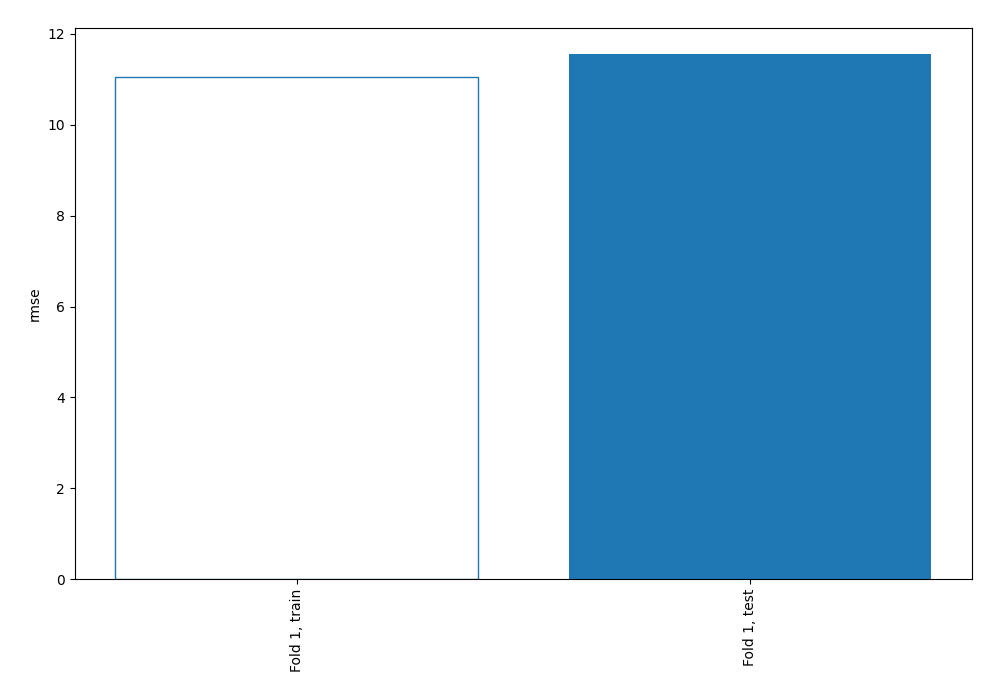

# Summary of 3_Linear

[<< Go back](../README.md)

## Linear Regression (Linear)
- **n_jobs**: -1
- **explain_level**: 2

## Validation
 - **validation_type**: split
 - **train_ratio**: 0.75
 - **shuffle**: True

## Optimized metric
rmse

## Training time

9.8 seconds

### Metric details:
| Metric   |       Score |
|:---------|------------:|
| MAE      |   9.61233   |
| MSE      | 133.553     |
| RMSE     |  11.5565    |
| R2       |   0.0563771 |
| MAPE     |   0.167857  |

## Learning curves

## Coefficients
| feature                  |   Learner_1 |
|:-------------------------|------------:|
| DEATH_EVENT              |   0.507662  |
| ejection_fraction        |   0.19268   |
| anaemia                  |   0.113917  |
| sex                      |   0.0986296 |
| serum_creatinine         |   0.0691772 |
| high_blood_pressure      |   0.0610459 |
| serum_sodium             |  -0.0320225 |
| platelets                |  -0.043612  |
| creatinine_phosphokinase |  -0.052763  |
| time                     |  -0.0566847 |
| diabetes                 |  -0.0861406 |
| intercept                |  -0.158756  |
| smoking                  |  -0.159573  |

## Permutation-based Importance

## True vs Predicted

## Predicted vs Residuals

## SHAP Importance

## SHAP Dependence plots

### Dependence (Fold 1)

## SHAP Decision plots

### Top-10 Worst decisions (Fold 1)

### Top-10 Best decisions (Fold 1)

[<< Go back](../README.md)
