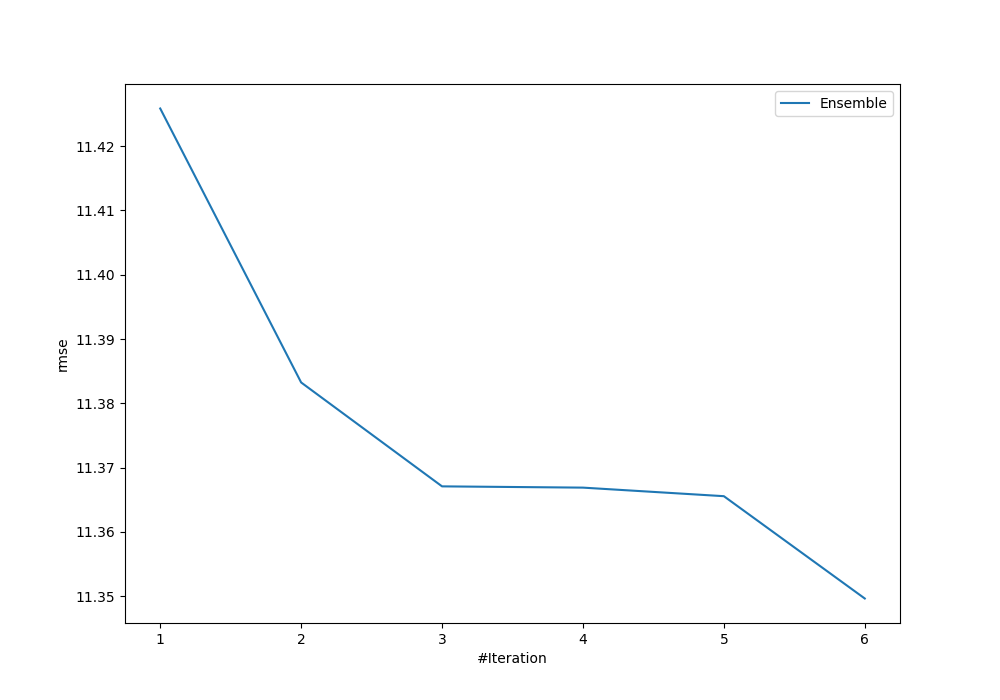
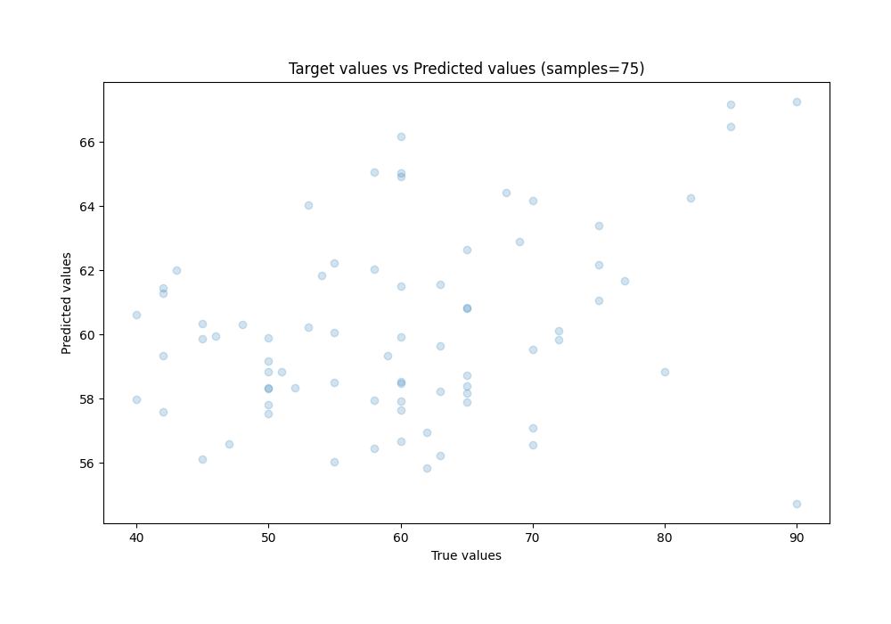
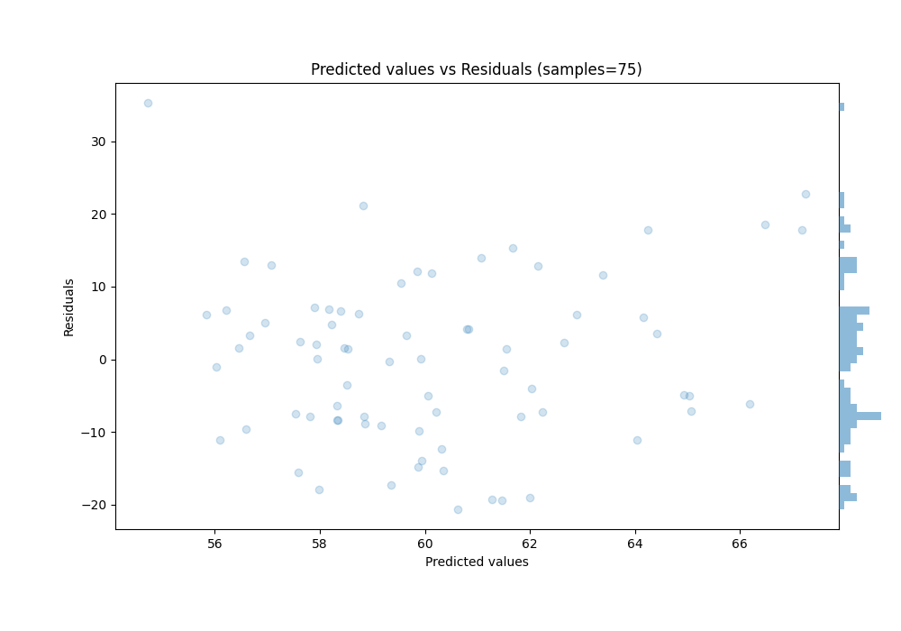

# Summary of Ensemble

[<< Go back](../README.md)

## Ensemble structure
| Model                   |   Weight |
|:------------------------|---------:|
| 2_DecisionTree          |        1 |
| 3_Linear                |        1 |
| 5_Default_NeuralNetwork |        3 |
| 6_Default_RandomForest  |        1 |

### Metric details:
| Metric   |       Score |
|:---------|------------:|
| MAE      |   9.24559   |
| MSE      | 128.815     |
| RMSE     |  11.3497    |
| R2       |   0.0898524 |
| MAPE     |   0.161734  |

## Learning curves

## True vs Predicted

## Predicted vs Residuals

[<< Go back](../README.md)
